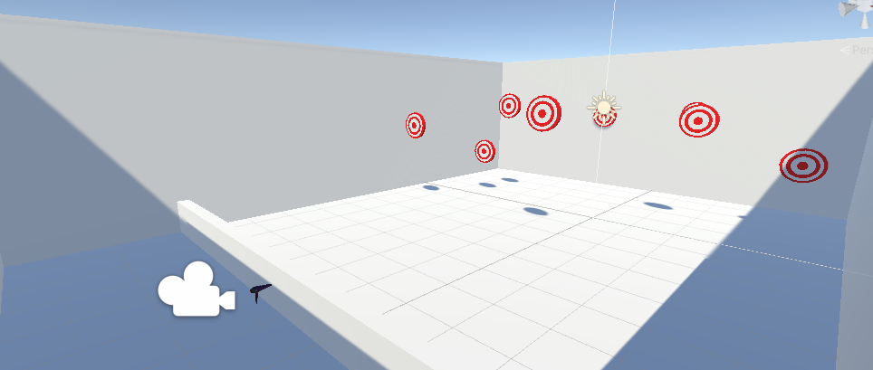
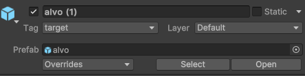
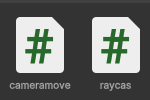

# raycast.gg
## autores
Gabriel Faria e Gabriele Batista Sousa
### Descrição 
Esse é um trabalho solicitado pela orientadora Aline Fimino, com o objetivo de ultilizar a ferramenta raycast na plataforma unity.
### Requisitos de instalação
para ver a cena é necessario o unity na versão `2023.1.11f1`

### Instalação 
1. Clonar o projeto `https://drive.google.com/drive/folders/1nFC_azGugmYBXrB1Ap3VVcpJlAThHp9W?usp=sharing`
2. Descompactar e abrir o arquivo e abrir o projeto no Unity.

### Desenvolvimento 
Para criar esse projeto foi preciso os sguintes passos:

Primeiro criamos uma cena,coerente com oque faremos:



Depois faremos com que o alvo vire um prefab e colocaremos a tag "target" para depois o chamarmos no código.



usaremos esse codigo para adicionar o raycast:
```ruby
using System.Collections;
using System.Collections.Generic;
using UnityEngine;

public class NewBehaviourScript : MonoBehaviour
{
    Ray ray;
    RaycastHit hitData;
    Vector3 point;
    //public Camera _camera;

    // Start is called before the first frame update
    void Start()
    {
        Cursor.lockState = CursorLockMode.Locked; 
    }

    // Update is called once per frame
    void Update()
    {
         if (UnityEngine.Input.GetKey(KeyCode.Mouse0))
        {
            ray = Camera.main.ScreenPointToRay(Input.mousePosition);
            Lancar(ray, 3);
        }
    }
     private void Lancar(Ray ray, int tipo)
     {  
        Debug.Log("acertou");
        if (Physics.Raycast(ray, out hitData))
        {
            string tag = hitData.collider.tag;
            GameObject hitObject = hitData.transform.gameObject;

            if (tag =="target")
                Destroy(hitObject);
        }
       
     }
}
````
Esse código faz com que o raycast siga o mouse, mas como o mouse está travado no centro da tela, o raycast sempre será lançado do centro. e sempre que acertar um prefab com a tag "target" ele o destruirá.



depois iremos colocar todos os scripts na câmera. e seu projeto está pronto

## Video de Demonstração
`https://youtu.be/AyOQ08FSe_w`
